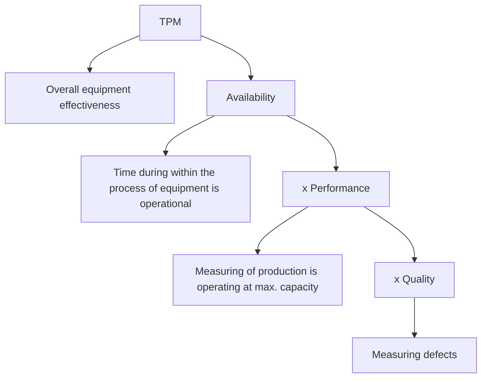

# 🚣🏼‍♂️ Total-Productive-Maintenance-Visual-Control-using-Minitab-software
This repository presents a real-world simulation of TPM implementation and visual control mechanisms within a steel manufacturing plant, leveraging Minitab for analysis and performance monitoring

---

## 🧢 Total Productive Maintenance (TPM)
TPM is a holistic approach to equipment maintenance and is commonly used in manufacturing industries
- It eliminates deficiencies from machines and equipment
- It minimizes or removes defects and detects downtime
- It emphasizes maintenance and improvement of process system and equipment environment
- It increases the operational efficiency of equipment

TPM is the key operational activity for managing quality:

