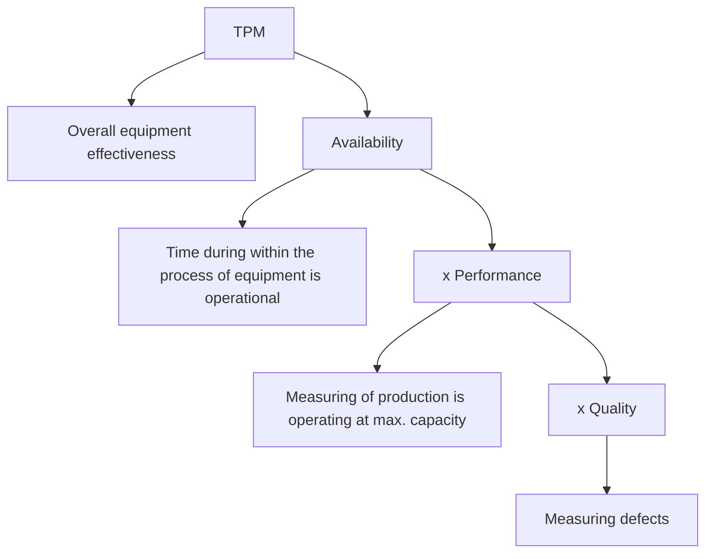

# 🚣🏼‍♂️ Total-Productive-Maintenance-Visual-Control-using-Minitab-software
This repository presents a real-world simulation of TPM implementation and visual control mechanisms within a steel manufacturing plant, leveraging Minitab for analysis and performance monitoring

---

## 🧢 Total Productive Maintenance (TPM)
TPM is a holistic approach to equipment maintenance and is commonly used in manufacturing industries
- It eliminates deficiencies from machines and equipment
- It minimizes or removes defects and detects downtime
- It emphasizes maintenance and improvement of process system and equipment environment
- It increases the operational efficiency of equipment

TPM is the key operational activity for managing quality:

## 🦧 8 elements of TPM
### Autonomous Maintenance
Includes maintenance of machines and equipment by greasing, cleaning, general inspection, and minimum preventive maintenance by the production operators

### Planned Maintenance
Includes developing and executing planned maintenance activities based on factors such as time, cost and productivity

### Equipment improvement
Includes measures to improve the performance and efficiency of the equipment. Measures are taken using different methods such as 5s, 5-Why analysis or Kaizen activities

### Education & Training
Includes providing systematic training to all the employees to maintain the equipment and increase productivity

### Equipment design excellence
Includes new equipment design and identification of equipment that requires less maintenance

### Quality Maintenance
Includes designing error detection and prevention methods into production processes

### Safety Health & Environment
Targets the goal of accident free workplace

### TPM in administration
Includes applying TPM techniques to administrative functions. The main applications of TPM for controlling the improved process are:

#### Spare parts management
Helps maintain and store spare parts of the equipment using 5S method

#### Measures for downtime
Helps collect data for downtime and conduct Root Cause Analysis (RCA)

#### Support & Guidance
Helps maintain SOPs and train employees to maintain the equipment

---

## 🛵 Visual Factory
A visual factory is a lean production environment where charts and signs are used to display information
- Make the immediate status of activities clear to all
- Enables the people involved to understand how each plant works
- Makes the work area self-explanatory at a glance
- Displays real-time information to the workforce
- Helps standardize the process and eliminates waste

---

## 🚂 Elements
## Organizing and standardizing the work place
- 5S: Specified regions and areas => color coding: To understand the system at a glance, teh work place is organized and standardized using

1. 5S [Sort, Set in Order, Shine, Standardize, Sustain]
2. Specified regions and areas are defined for specific purposes
3. Colors are defined for specific activities

### Sharing information
One of the important elements in a visual factory is information sharing

*3-minute management approach* -> Issues, progress, and information are communicated to the workforce in three minutes using graphics

*Signalling system* -> Visual elements, audio or both are used to signal the status of the process, sub-process or machines

*Visual controls* -> In a visual factory, visual methods are used for communication

*Control board* -> Helps people to read the complete process at a glance and analyze how process is working

*SOP* -> Is a set of rules & regulations that must be mandatorily followed in a particular process

*Control chart* -> provides information on process performance helps to understand the process is in control, and helps sustain the improvement made

*Control plans* -> Are the plans that are displayed to evaluate the performance of the proess on a timely basis 

### Benefits
- Displays the real-time scenario
- Keeps the workforce well-informed of the process
- Aide in solving issues and bottlenecks immediatly
- Highlights the support required, when needed
- Improves process performance
- Monitors, maintains and controls inventory

---

## ⌚️ 5S- Control Methods
### Seiri/Sort
Seiri is focused on sorting and getting organized.
- Sorting necessary or unnecessary items
- Keeping items based on requirement
- Make workflow smooth and efficient
- Organize storage of all items
- Identify frequently and non-frequently used items
- Preventing accumulation of items by assigning them tags
Seiri helps in:
- Simplifying tasks
- Effectively using the work place
- Purchasing items carefully

### Seiton/Stabilize
Seiton is for Straighten or Stabilize
- Classify and set items
- Improve efficiency
- Prevent loss and wastage of time
- Choose correct place, position or holder for tools, items and materials
- Mark or color code items so that they can be visually indicated

### Seiso/Shine
Seiso or Shine involves keeping the workplace shiny and clean by:
- Eliminating clutter and organizing items
- Marking the workplace clean so that it is easy to identify the malfunctioning equipment
- Preventing mess
- Finding the root cause of contamination

### Seiketsu/Standardize
- Standardising best practices across the work place
- Performing tasks in a standard manner
- Ensuring personal and environmental cleanliness
*Tools include*:
- Job-cycle charts
- Visual charts
- Scheduling 5 min of 5S activity
- Checklists
- Visual management with color coding

### Shiesuke/Sustain
Sheisuke is the final step and helps:
- Maintain a discipline and committment
- Maintain orderliness
- Define a new status quo and standard for workplace organization
*Tools include*:
- Department tours
- Performance reviews
- Team and management check-ins
- Pocket manuals
- Newsletters
- Signs and charts
- Checksheets

---
