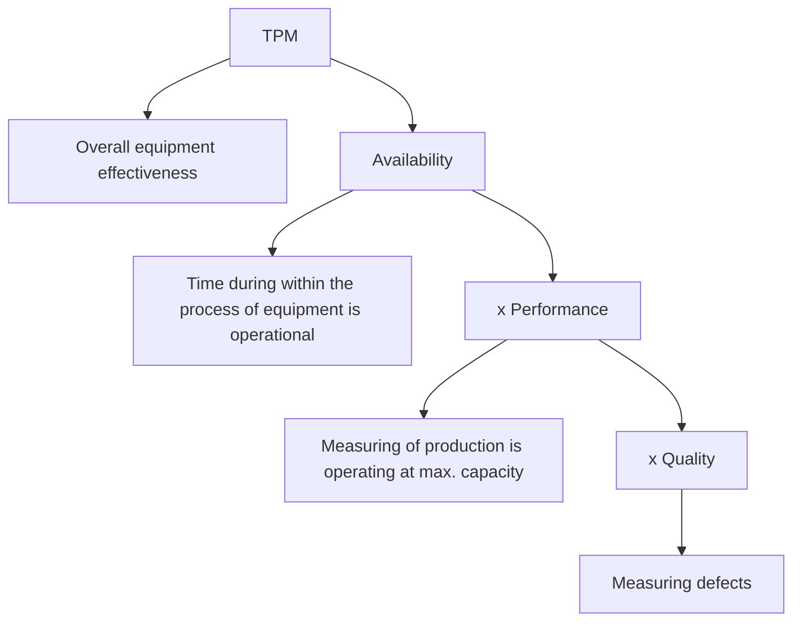

# 🚣🏼‍♂️ Total-Productive-Maintenance-Visual-Control-using-Minitab-software
This repository presents a real-world simulation of TPM implementation and visual control mechanisms within a steel manufacturing plant, leveraging Minitab for analysis and performance monitoring

---

## 🧢 Total Productive Maintenance (TPM)
TPM is a holistic approach to equipment maintenance and is commonly used in manufacturing industries
- It eliminates deficiencies from machines and equipment
- It minimizes or removes defects and detects downtime
- It emphasizes maintenance and improvement of process system and equipment environment
- It increases the operational efficiency of equipment

TPM is the key operational activity for managing quality:

## 🦧 8 elements of TPM
### Autonomous Maintenance
Includes maintenance of machines and equipment by greasing, cleaning, general inspection, and minimum preventive maintenance by the production operators

### Planned Maintenance
Includes developing and executing planned maintenance activities based on factors such as time, cost and productivity

### Equipment improvement
Includes measures to improve the performance and efficiency of the equipment. Measures are taken using different methods such as 5s, 5-Why analysis or Kaizen activities

### Education & Training
Includes providing systematic training to all the employees to maintain the equipment and increase productivity

### Equipment design excellence
Includes new equipment design and identification of equipment that requires less maintenance

### Quality Maintenance
Includes designing error detection and prevention methods into production processes

### Safety Health & Environment
Targets the goal of accident free workplace

### TPM in administration
Includes applying TPM techniques to administrative functions. The main applications of TPM for controlling the improved process are:

#### Spare parts management
